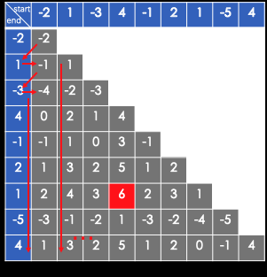
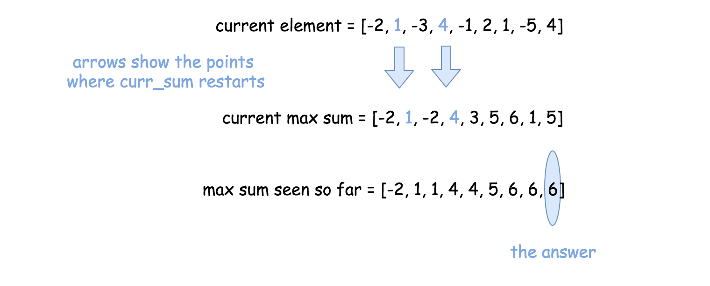
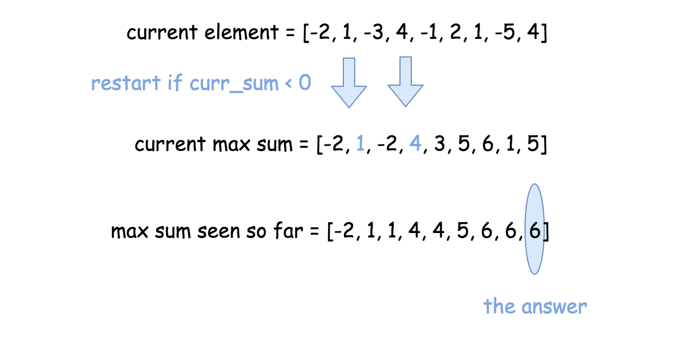

# 53. 最大子序和

给定一个整数数组 `nums` ，找到一个具有最大和的连续子数组（子数组最少包含一个元素），返回其最大和。

**示例 1:**  
>**输入：**  [-2,1,-3,4,-1,2,1,-5,4],  
>**输出：** 6  
>**解释：** 连续子数组 [4,-1,2,1] 的和最大，为 6。

**进阶：**

* 如果你已经实现复杂度为 O(n) 的解法，尝试使用更为精妙的分治法求解。

---
**解法一：暴力法**  
思路：  
每个子序列都有一个 `start` 和 `end` ，（`start <= end`），共有 $\frac{(n^2)}{2}$ 个子序列，如果能在 O(1) 的情形下计算一个子序列的和，可以在 O($n^2$) 完成暴力破解。其实，已知 `nums[a,b]` 的和,求 `nums[a,b+1]` 的和，只需要加上 `nums[b+1]` 即可。



```Java
    public int maxSubArray(int[] nums) {
        int len = nums.length;
        int max = Integer.MIN_VALUE;
        int sum = 0;
        for (int i = 0; i < len; i++) {
            sum = 0;
            for(int j = i; j < len; j++) {
                sum += nums[j];
                if(sum >= max){
                    max = sum;
                }
            }
        }
        return max;
    }
```

**复杂度分析：**  

* 时间复杂度：$O(n^2)$。
* 空间复杂度：$O(1)$，只需要temp变量（保存上一个值）和max变量（保存最大值）即可。

---
**解法二：贪心**  
思路：

* 使用单个数组作为输入来查找最大（或最小）元素（或总和）的问题，贪心算法是可以在线性时间解决的方法之一。
* 每一步都选择最佳方案，到最后就是全局最优的方案。

**算法：**  
该算法通用且简单：遍历数组并在每个步骤中更新：

* 当前元素
* 当前元素位置的最大和
* 迄今为止的最大和



```Java
 public int maxSubArray(int[] nums) {
    int n = nums.length;
    int currSum = nums[0], maxSum = nums[0];

    for(int i = 1; i < n; ++i) {
      currSum = Math.max(nums[i], currSum + nums[i]);
      maxSum = Math.max(maxSum, currSum);
    }
    return maxSum;
  }
```

**复杂度分析：**  

* 时间复杂度：$O(N)$，只遍历一次数组。
* 空间复杂度：$O(1)$，只使用了常数空间。

---
**解法三：动态规划**  
思路：  

* 在整个数组或在固定大小的滑动窗口中找到总和或最大值或最小值的问题可以通过动态规划（DP）在线性时间内解决。
* 有两种标准 DP 方法适用于数组：
    1. 常数空间，沿数组移动并在原数组修改。
    2. 线性空间，首先沿 left->right 方向移动，然后再沿 right->left 方向移动。 合并结果。

* 我们在这里使用第一种方法，因为可以修改数组跟踪当前位置的最大和。
* 下一步是在知道当前位置的最大和后更新全局最大和。



**代码一：**

```Java
 public int maxSubArray(int[] nums) {
    if (nums == null || nums.length == 0) return 0;
        int ans = 0;

        // 1. 状态定义
        // dp[i] 表示前 i 个元素的最大连续子数组的和
        int[] dp = new int[nums.length];

        // 2. 状态初始化，数组中第一个元素的最大和就是第一个元素值
        dp[0] = nums[0];
        ans = nums[0];

        // 3. 状态转移
        // 转移方程：dp[i] = max(dp[i - 1], 0) + nums[i]
        //  dp 当前元素的值等于前一个元素值和 0 的最大值再加上 nums[i]
        for (int i = 1; i < nums.length; i++) {
            dp[i] = Math.max(dp[i - 1], 0) + nums[i];
            // 更新最大和
            ans = Math.max(ans, dp[i]);
        }
        return ans;
    }
```

**复杂度分析：**  

* 时间复杂度：$O(N)$，只遍历一次数组。
* 空间复杂度：$O(N)$。

上面的状态转移方程 `dp[i] = max(dp[i - 1], 0) + nums[i]` 看出，当前的状态的值只取决于前一个状态值，所以我们可以使用一个变量来代替 `dp[i]` 和 `dp[i - 1]`。

**代码二：**

```Java
 public int maxSubArray(int[] nums) {
    if (nums == null || nums.length == 0) return 0;
        int ans = 0;

        // 使用 currSum 代替 dp[i]
        int currSum = nums[0];
        ans = nums[0];

        for (int i = 1; i < nums.length; i++) {
            currSum = Math.max(currSum, 0) + nums[i];
            // 更新最大和
            ans = Math.max(ans, currSum);
        }
        return ans;
    }
  }
```

**复杂度分析：**  

* 时间复杂度：$O(N)$，只遍历一次数组。
* 空间复杂度：$O(1)$，只使用了常数空间。
