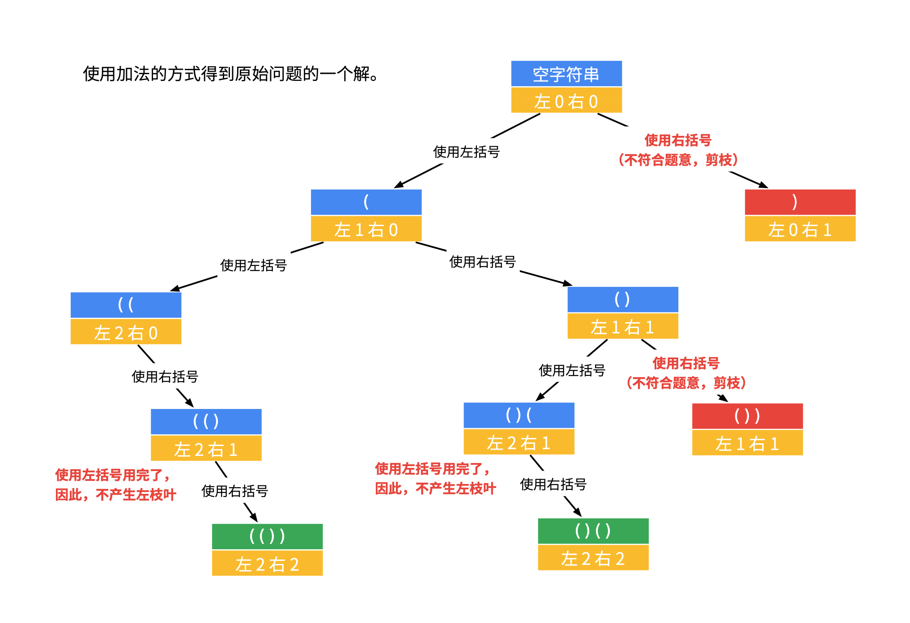

# 22. 括号生成

数字 `n` 代表生成括号的对数，请你设计一个函数，用于能够生成所有可能的并且 **有效的** 括号组合。

**示例 1:**  
>**输入:** n = 3  
>**输出:** [  
>&emsp;&emsp;&emsp;"((()))",  
>&emsp;&emsp;&emsp;"(()())",  
>&emsp;&emsp;&emsp;"(())()",  
>&emsp;&emsp;&emsp;"()(())",  
>&emsp;&emsp;&emsp;"()()()"  
>&emsp;&emsp;&emsp;]  

**解法一：**  
思路：  

`left` 表示“左括号还有几个没有用掉”，`right` 表示“右括号还有几个没有用掉”，可以画出递归树。



```Java
class Solution {
    List<String> result = new ArrayList<>();
    public List<String> generateParenthesis(int n) {
        // 做加法
        dfs(n, n, "");
        return result;
    }
    /**
     * 使用深度优先搜索
     */
    private void dfs(int left, int right, String str) {
        // 当左右括号都加完时，终止递归
        if (left == 0 && right == 0) {
            result.add(str);
            return;
        }
        // 左括号>0时，添加左括号
        // 选择左括号，然后进入下一层搜索
        if (left > 0) {
            dfs(left - 1, right, str + "(");
        }

        // 当左括号、右括号的数量一样时，只能选择左括号
        // 右括号剩余数量大于左括号时，添加右括号
        if (right > left) {
            dfs(left, right - 1, str + ")");
        }
    }
}
```

**复杂度分析：**  

* 时间复杂度：$O(\dfrac{4^n}{\sqrt{n}})$，在回溯过程中，每个答案需要 $O(n)$ 的时间复制到答案数组中。
* 空间复杂度：$O(N)$，我们所需要的空间取决于递归栈的深度，每一层递归函数需要 $O(1)$ 的空间，最多递归 $2n$ 层，因此空间复杂度为 $O(n)$。
